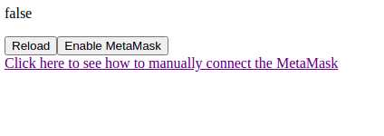
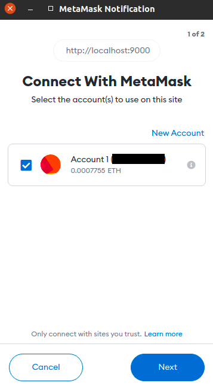
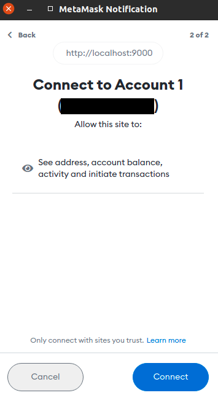
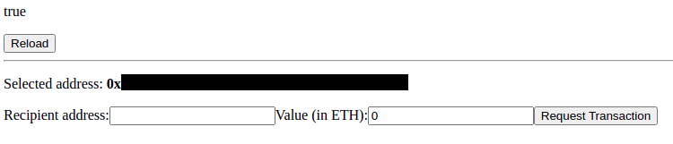
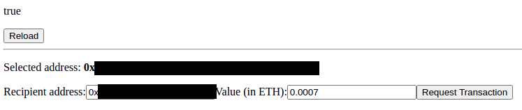
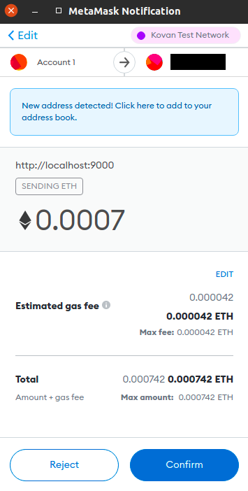
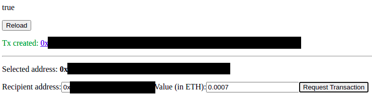

<h1 align="center">
    <a href="https://metamask.io/">"></a>
</h1>

<h3 align="center">POC for manual connection between the browser and MetaMask.</h3>

---

## Table of Contents

* [Introduction](#introduction)
* [Requirements](#requirements)
* [Running local](#running-local)
* [Connecting with MetaMask](#connecting-with-metamask)
* [Requesting a new payment](#requesting-a-new-payment)


## Introduction

This repository is a POC to make a manual connection between the browser and your installed MetaMask to request a payment. After requesting the payment, you'll have the Reject/Confirm choices.

## Requirements

This POC uses vue.js and web3.js and the files are expected to be downloaded from their CDN.

To run this full tutorial, you'll need to use `python` to server the page locally.

## Running local

To run this repo local you need to clone:

```bash
git clone git@github.com:rfreis/metamask-poc.git
```

You can run locally using python http server. This will make the page available on [http://localhost:9000](http://localhost:9000).

```bash
python3 -m http.server 9000
```

## Connecting with MetaMask

The first access will give you options to open the MetaMask and start the session. You can click on `Enable MetaMask` or at the link below to [see how to manually connect the MetaMask](https://metamask.zendesk.com/hc/en-us/articles/360045901112-Manually-connecting-to-a-dapp)



After that, you'll be prompted to continue:




If everything works fine, you should see the screen below with your wallet's address:



## Requesting a new payment

To request a new payment, you just need fill the Recipient's address and the amount in ETH, like the screenshot below:



After that, you'll be prompted to Reject/Confirm the transaction and you'll be able to see the network's fees:



After getting the confirmation, you'll receive the TX with a clickable link to open it on [Etherscan](https://www.etherscan.io).



- Note: if you are using the testnet to make the transaction, try to change the explorer URL for the selected network. Example: from `https://etherscan.io/tx/<tx>` to `https://kovac.etherscan.io/tx/<tx>`.

